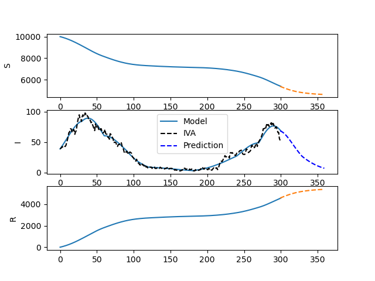
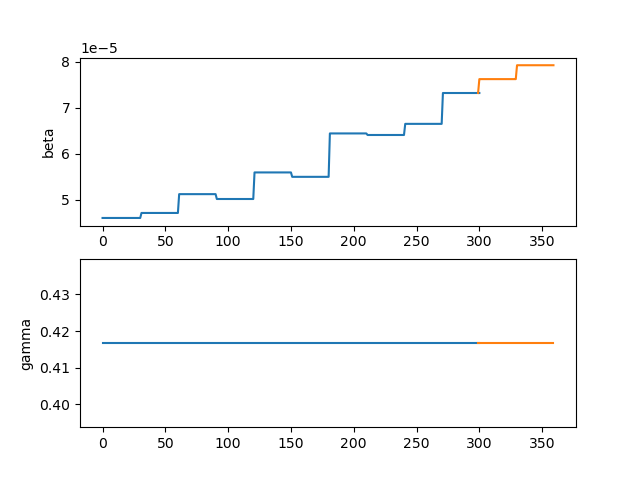
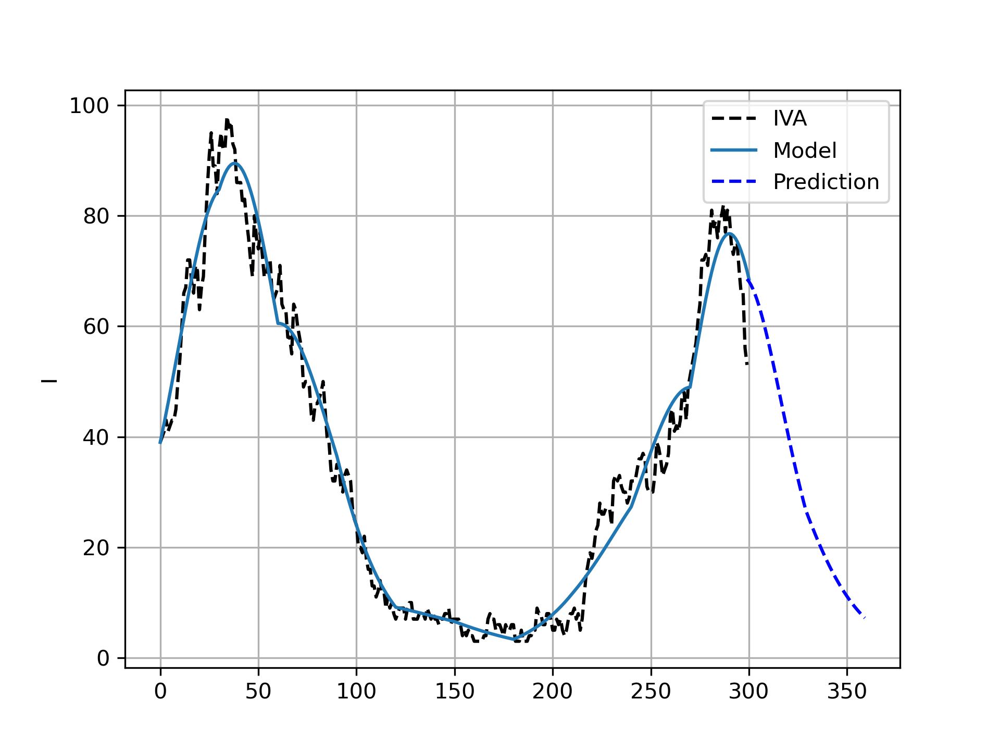

# Modeling of COVID in Västra Götaland
This code tries to model the number of patients at the Intesive health
care at Västra Götaland, Sweden. The scripts fits a SIR model with time-varying parameters.


## Data source
The data is downloaded from *Svenska Intensivvårdsregistret* at:
https://portal.icuregswe.org/siri/report/corona.covid-dagligen .


To get only Västra Götaland, select *Avdelningar* in the Urval and then the excel file can be downloaded as excel in the *DETALJER* tab.

## SIR - Model 
The model used is the *Kermack-McKendrick Model*, which is a type of SIR model, described at: [Wolfram](https://mathworld.wolfram.com/Kermack-McKendrickModel.html).


For a constant population, where there are $S$ nr of susceptible (people that can get infected), $I$ is the nr of infected people and $R$ is the nr of people 
that have recovered from the infection. The dynamic equation of the variables are then

$$
\frac{dS}{dt} = -\beta \, S \, I 
$$

$$
\frac{dI}{dt} = \beta \, S \, I - \gamma \, I
$$

$$
\frac{dR}{dt} = \gamma \, I
$$

Where $\beta$ is the infection rate and $\gamma$ the recovery rate. A common measure is the *epidemiological threshold*

$$
\mathcal{R}_0 = \dfrac{\beta \, S}{\gamma},
$$

$\mathcal{R}_0$ is commonly described as how many new infections a single infected person causes.

## Model estimation
The Casadi toolbox is used to optimize the model parameters to fit the data. More can be found at: https://web.casadi.org/

## Requirements
```
matplotlib
xlrd
numpy
casadi
```
## Results
The data was retrived at: 2021-01-24 and the model predicts 30 days ahead.








